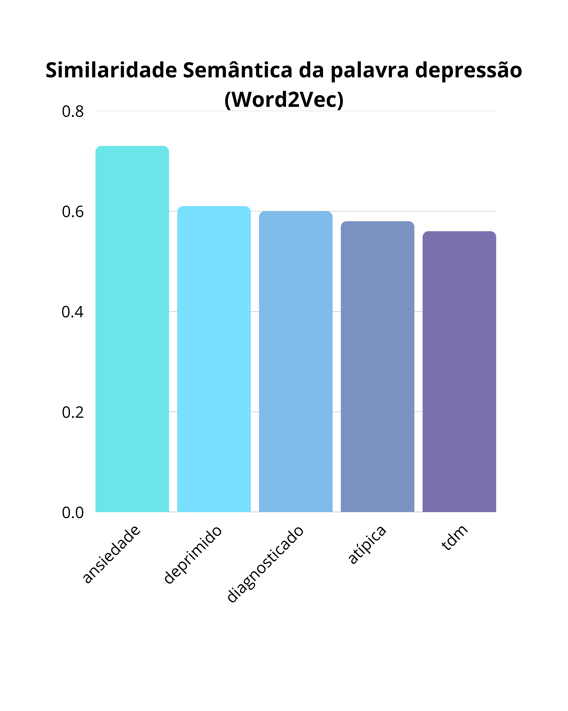
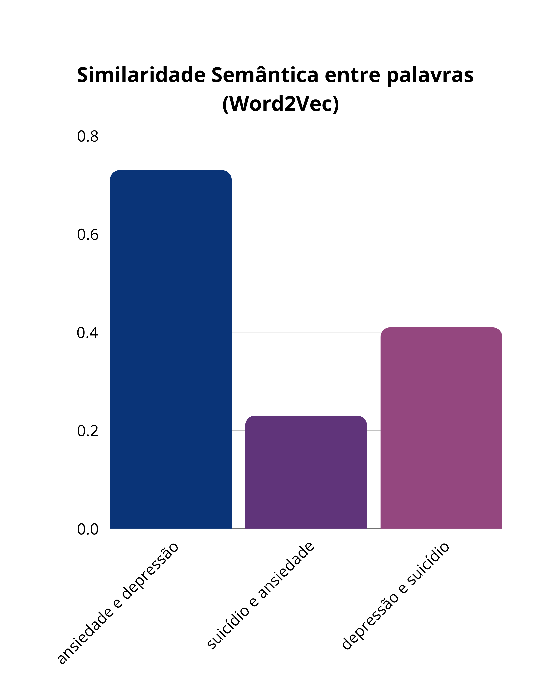

### a. Quais relações semânticas o modelo conseguiu capturar?

* O modelo identificou uma forte relação entre "depressão" e "ansiedade", com uma similaridade de 0.73. Isso reflete a frequência com que esses termos são discutidos juntos no corpus.
* "Ansiedade" foi semanticamente ligada a "pânico", "social" (provavelmente ansiedade social), "ataques" (ataques de pânico) e "sudorese" (um sintoma físico).
* "Depressão" foi ligada a "deprimido" (estado) e "tdm" (Transtorno Depressivo Maior) conforme o gráfico a seguir: 

* "Suicídio" foi corretamente associado a verbos de ação como "matar" e "cometer", e a conceitos relacionados como "suicida" e "morte".
* A relação entre "depressão" e "suicídio" (similaridade de 0.42) foi capturada como mais forte do que a entre "ansiedade" e "suicídio" (similaridade de 0.23) conforme o gráfico a seguir: 

* A analogia `psicólogo` + `saúde` identificou com sucesso o ecossistema de tratamento, retornando "mental" (saúde mental), "terapeuta", "psiquiatra", "terapia", "médico" e "ajuda".
* O modelo foi capaz de isolar conceitos. A operação `depressão` + `ansiedade` - `suicídio` removeu o contexto de desfecho extremo e retornou termos relacionados a diagnóstico e tipos de ansiedade, como "social", "pânico", "diagnosticado" e "ataques".

### b. Houve confusões semânticas? Qual a justificativa?

Sim, foi observada uma confusão semântica notável na exploração da palavra "medo".

Ao buscar as palavras mais similares a "medo", o modelo retornou: `[('posso', 0.59), ('preocupado', 0.56), ('tanto', 0.54), ('ansiedade', 0.53), ('disso', 0.52)]`.

* Embora "preocupado" e "ansiedade" sejam semanticamente relevantes, as palavras "posso", "tanto" e "disso" não são. Elas são palavras funcionais (stop words) que, sozinhas, não carregam o significado de "medo". Isso indica que o modelo não capturou apenas a semântica pura, mas também a *similaridade sintática* ou *contextual*. É provável que essas palavras apareçam frequentemente nas mesmas posições ou estruturas de frase que a palavra "medo" (ex: "tenho *tanto* medo", "medo *disso*", "não *posso* sentir").

### c. Quais as diferenças observadas usando Word2Vec e Doc2Vec?
   * **Word2Vec** 
    aprende vetores para *palavras* individuais. Sua exploração foca em encontrar palavras similares a outras palavras (ex: `wv.most_similar(positive=["depressão"])`) ou calcular a similaridade entre elas (ex: `wv.similarity('ansiedade', 'depressão')`). Na exploração do **Word2Vec**, as consultas são feitas com palavras, e os resultados são outras palavras do vocabulário.
 * **Doc2Vec** aprende vetores para *documentos* inteiros (no caso, as sentenças do corpus, cada uma identificada por uma tag única). Na exploração do **Doc2Vec**, a consulta é uma lista de palavras (um novo documento, ex: `['sentir', 'ansioso', 'trabalho']`) para a qual o modelo *infere* um vetor. O modelo então retorna os *documentos* (tags) mais similares do corpus de treinamento, e não apenas palavras. Por exemplo, a consulta retornou o "Documento 40274" (`<<alguma dica ansiedade trabalho poderia usar alguns conselhos>>`) como o mais similar.
